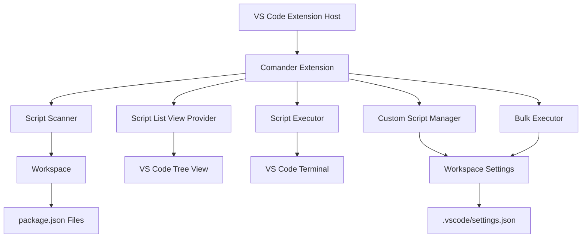
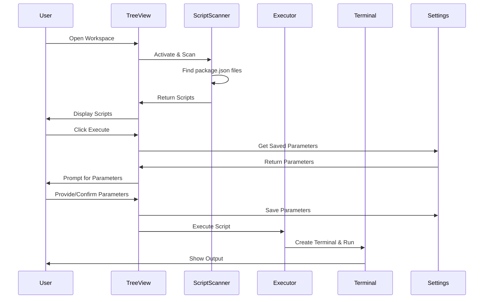

# Design Document: Comander VS Code Extension

## Overview

Comander is a Visual Studio Code extension that enhances the Node.js developer experience by providing an intuitive interface for discovering, managing, and executing npm scripts. The extension consists of five core components:

1. **Script Scanner**: Discovers and parses package.json files throughout the workspace
2. **Script List View**: Displays scripts in a tree view with execution controls
3. **Script Executor**: Manages terminal-based script execution
4. **Custom Script Manager**: Handles user-defined scripts with persistence
5. **Bulk Executor**: Sequences multiple script executions

The extension follows the VS Code Extension API patterns, utilizing the TreeDataProvider for UI rendering, FileSystemWatcher for file change detection, and the Terminal API for script execution. All user-specific data (custom scripts, saved parameters, bulk sequences) is persisted in workspace settings.

## Architecture

### High-Level Architecture



### Component Interaction Flow



### File System Organization

```
workspace/
├── .vscode/
│   └── settings.json          # Custom scripts, parameters, bulk sequences
├── package.json               # Root npm scripts
├── project-a/
│   └── package.json           # Project A npm scripts
└── project-b/
    └── package.json           # Project B npm scripts
```

## Components and Interfaces

### 1. Script Scanner

**Responsibilities:**
- Discover all package.json files in workspace (excluding node_modules)
- Parse package.json scripts section
- Watch for file changes and re-scan within 500ms
- Handle parse errors gracefully
- Group scripts by project location

**Interface:**
```typescript
interface ScriptScanner {
  scan(workspaceRoot: string): Promise<ScriptCollection>;
  watch(callback: (scripts: ScriptCollection) => void): Disposable;
  parsePackageJson(filePath: string): Promise<PackageScripts | ParseError>;
}

interface ScriptCollection {
  projects: Map<string, ProjectScripts>; // key: relative path from workspace root
  errors: ParseError[];
}

interface ProjectScripts {
  projectPath: string;
  packageJsonPath: string;
  scripts: Map<string, string>; // key: script name, value: command
}

interface ParseError {
  filePath: string;
  error: string;
}
```

**Implementation Details:**
- Use `vscode.workspace.findFiles('**/package.json', '**/node_modules/**')` for discovery
- Use `vscode.workspace.createFileSystemWatcher` for change detection with 500ms debounce
- Parse JSON with try-catch and return detailed error messages
- Store relative paths using `vscode.workspace.asRelativePath()`

### 2. Script List View Provider

**Responsibilities:**
- Render tree view with hierarchical script organization
- Display execution, edit, and delete buttons
- Handle bulk execution mode toggle
- Show script metadata (last execution timestamp)
- Apply VS Code theming

**Interface:**
```typescript
interface ScriptListProvider extends vscode.TreeDataProvider<ScriptItem> {
  refresh(): void;
  getChildren(element?: ScriptItem): ScriptItem[];
  getTreeItem(element: ScriptItem): vscode.TreeItem;
  toggleBulkMode(): void;
  getSelectedScripts(): ScriptItem[];
}

interface ScriptItem {
  type: 'project' | 'npm-script' | 'custom-script';
  label: string;
  command?: string;
  projectPath?: string;
  lastExecuted?: Date;
  iconPath?: vscode.ThemeIcon;
}
```

**Implementation Details:**
- Root nodes represent projects (collapsed by default if multiple projects)
- Child nodes represent scripts with inline buttons
- Use `vscode.TreeItemCollapsibleState` for hierarchical display
- Apply theme icons: `$(play)` for execute, `$(edit)` for edit, `$(trash)` for delete
- Use `contextValue` on tree items to control button visibility

### 3. Script Executor

**Responsibilities:**
- Execute npm scripts in VS Code terminals
- Stream output in real-time
- Capture exit codes
- Manage concurrent executions
- Handle npm availability errors
- Disable buttons during execution

**Interface:**
```typescript
interface ScriptExecutor {
  execute(script: ScriptItem, parameters?: string): Promise<ExecutionResult>;
  isExecuting(scriptId: string): boolean;
  terminate(scriptId: string): void;
  getMostRecentScript(): ScriptItem | null;
}

interface ExecutionResult {
  success: boolean;
  exitCode: number;
  duration: number; // milliseconds
  scriptName: string;
}
```

**Implementation Details:**
- Use `vscode.window.createTerminal()` for each execution
- Execute with `npm run <script> -- <parameters>` format
- Track executing scripts in a Map<scriptId, Terminal>
- Listen to terminal close events to capture exit codes (VS Code Terminal API limitation: exit code may not be available)
- Check npm availability with `which npm` or `where npm` before execution
- Show progress in status bar with `vscode.window.withProgress()`

### 4. Custom Script Manager

**Responsibilities:**
- Create, read, update, delete custom scripts
- Validate script names and commands
- Persist to workspace settings
- Enforce limits (50 scripts max, 100 char names, 500 char commands)
- Handle name uniqueness

**Interface:**
```typescript
interface CustomScriptManager {
  create(name: string, command: string, projectPath: string): Promise<Result<CustomScript>>;
  update(id: string, name: string, command: string): Promise<Result<CustomScript>>;
  delete(id: string): Promise<Result<void>>;
  list(projectPath?: string): CustomScript[];
  get(id: string): CustomScript | null;
}

interface CustomScript {
  id: string; // UUID
  name: string;
  command: string;
  projectPath: string;
  createdAt: Date;
  updatedAt: Date;
}

type Result<T> = { success: true; data: T } | { success: false; error: string };
```

**Implementation Details:**
- Store in workspace settings under `comander.customScripts` as array
- Generate UUIDs for custom script IDs
- Validate input synchronously before persistence
- Use `vscode.workspace.getConfiguration().update()` for persistence
- Check name uniqueness within project scope (custom + npm scripts)

### 5. Bulk Executor

**Responsibilities:**
- Manage bulk execution mode
- Handle script selection and ordering
- Execute scripts sequentially
- Handle failures and timeouts (300s per script)
- Save and load bulk sequences

**Interface:**
```typescript
interface BulkExecutor {
  executeBulk(scripts: ScriptItem[], order: number[]): Promise<BulkResult>;
  saveSequence(name: string, scripts: ScriptItem[], order: number[]): Promise<Result<BulkSequence>>;
  loadSequence(id: string): BulkSequence | null;
  listSequences(): BulkSequence[];
  deleteSequence(id: string): Promise<Result<void>>;
}

interface BulkResult {
  totalScripts: number;
  successfulScripts: number;
  failedScript?: { name: string; exitCode: number; index: number };
  timedOutScript?: { name: string; index: number };
  totalDuration: number;
}

interface BulkSequence {
  id: string;
  name: string;
  scriptIds: string[]; // Script identifiers (project path + script name)
  order: number[];
  createdAt: Date;
}
```

**Implementation Details:**
- Execute scripts using ScriptExecutor sequentially (await each execution)
- Implement 300-second timeout using `Promise.race()` with `setTimeout()`
- Halt on first non-zero exit code
- Store sequences in workspace settings under `comander.bulkSequences`
- Validate sequence references before execution and warn about missing scripts
- Track execution state to prevent concurrent bulk executions

### 6. Settings Manager

**Responsibilities:**
- Persist and retrieve script parameters
- Store custom scripts
- Store bulk execution sequences
- Handle read/write failures gracefully

**Interface:**
```typescript
interface SettingsManager {
  getParameters(projectPath: string, scriptName: string): string | null;
  setParameters(projectPath: string, scriptName: string, parameters: string): Promise<void>;
  removeParameters(projectPath: string, scriptName: string): Promise<void>;
  getCustomScripts(): CustomScript[];
  setCustomScripts(scripts: CustomScript[]): Promise<void>;
  getBulkSequences(): BulkSequence[];
  setBulkSequences(sequences: BulkSequence[]): Promise<void>;
}
```

**Settings Schema:**
```json
{
  "comander.scriptParameters": {
    "type": "object",
    "description": "Saved parameters for scripts",
    "additionalProperties": {
      "type": "object",
      "additionalProperties": {
        "type": "string"
      }
    }
  },
  "comander.customScripts": {
    "type": "array",
    "description": "Custom user-defined scripts",
    "items": {
      "type": "object",
      "properties": {
        "id": { "type": "string" },
        "name": { "type": "string" },
        "command": { "type": "string" },
        "projectPath": { "type": "string" },
        "createdAt": { "type": "string" },
        "updatedAt": { "type": "string" }
      }
    }
  },
  "comander.bulkSequences": {
    "type": "array",
    "description": "Saved bulk execution sequences",
    "items": {
      "type": "object",
      "properties": {
        "id": { "type": "string" },
        "name": { "type": "string" },
        "scriptIds": { "type": "array", "items": { "type": "string" } },
        "order": { "type": "array", "items": { "type": "number" } },
        "createdAt": { "type": "string" }
      }
    }
  }
}
```

## Data Models

### Script Identification

Scripts are uniquely identified by the combination of:
- **Project Path**: Relative path from workspace root (e.g., "", "project-a", "project-b")
- **Script Name**: The script name from package.json or custom script name
- **Script Type**: "npm" or "custom"

Format: `{projectPath}:{scriptType}:{scriptName}`

Examples:
- `:npm:build` (root package.json build script)
- `project-a:npm:test` (project-a test script)
- `:custom:deploy-staging` (root custom script)

### State Management

The extension maintains the following runtime state:
- **Active Executions**: Map of scriptId to Terminal instances
- **Last Execution Times**: Map of scriptId to timestamp
- **Most Recent Script**: scriptId of last executed script (for keyboard shortcut)
- **Bulk Mode Enabled**: Boolean flag
- **Selected Scripts**: Set of scriptIds for bulk execution
- **Execution Order**: Array of indices for bulk execution

## Correctness Properties

*A property is a characteristic or behavior that should hold true across all valid executions of a system—essentially, a formal statement about what the system should do. Properties serve as the bridge between human-readable specifications and machine-verifiable correctness guarantees.*


### Property 1: Workspace Scanning Completeness

*For any* workspace structure containing package.json files outside of node_modules directories, the Script_Scanner SHALL discover all such files regardless of directory depth or location.

**Validates: Requirements 1.1**

### Property 2: Parse Error Handling

*For any* invalid JSON content in a package.json file, the Script_Scanner SHALL produce a ParseError containing the file path and error description without crashing.

**Validates: Requirements 1.4**

### Property 3: Multi-Project Grouping

*For any* workspace containing multiple package.json files, the Script_Scanner SHALL group scripts by their relative project path from the workspace root, and each script SHALL be associated with exactly one project path.

**Validates: Requirements 1.5**

### Property 4: Execution State Tracking

*For any* script execution, the extension SHALL track the execution state such that the script's execution button is disabled while executing and re-enabled when execution completes or is terminated.

**Validates: Requirements 2.5**

### Property 5: Concurrent Terminal Isolation

*For any* set of scripts executed concurrently, each script execution SHALL receive a unique terminal instance, and no two executions SHALL share the same terminal.

**Validates: Requirements 2.8**

### Property 6: Command Construction Format

*For any* script name and parameter string, the Script_Executor SHALL construct the command in the format `npm run <scriptName> -- <parameters>` where the double-dash separator is present if and only if parameters are non-empty.

**Validates: Requirements 3.2, 3.3**

### Property 7: Parameter Persistence Round-Trip

*For any* script identifier (project path + script name) and parameter string, saving parameters to settings and then retrieving them SHALL return the exact same parameter string, and clearing parameters SHALL result in retrieval returning null.

**Validates: Requirements 3.4, 3.6, 3.8, 3.9**

### Property 8: Input Validation

*For any* custom script name or command string:
- If the string length exceeds the maximum (100 chars for names, 500 chars for commands), validation SHALL reject it
- If the string contains only whitespace or is empty, validation SHALL reject it
- If the name already exists within the project scope (including both npm and custom scripts), validation SHALL reject it

This validation SHALL apply consistently during both creation and editing of custom scripts.

**Validates: Requirements 4.2, 4.3, 4.7, 5.6, 5.7, 5.8, 5.9**

### Property 9: Custom Script CRUD Persistence

*For any* custom script:
- Creating and then retrieving the script SHALL return a script with the same name, command, and project path
- Updating a script and then retrieving it SHALL return the script with updated values
- Deleting a script and then attempting to retrieve it SHALL return null

All operations SHALL persist to and retrieve from workspace settings correctly.

**Validates: Requirements 4.5, 5.3, 5.5**

### Property 10: Parameter Preservation on Rename

*For any* custom script with saved parameters, renaming the script SHALL preserve the parameter association such that executing the renamed script SHALL retrieve the same parameters that were saved before the rename.

**Validates: Requirements 5.11**

### Property 11: Bulk Execution Order

*For any* ordered sequence of scripts with specified execution order indices, the Bulk_Executor SHALL execute the scripts sequentially in the exact order specified by the order array.

**Validates: Requirements 6.5**

### Property 12: Bulk Execution Failure Halting

*For any* bulk execution sequence containing a script that returns a non-zero exit code, execution SHALL halt immediately after the failing script, no subsequent scripts in the sequence SHALL execute, and an error notification SHALL indicate the failing script name and its position in the sequence.

**Validates: Requirements 6.6**

### Property 13: Bulk Sequence Persistence Round-Trip

*For any* bulk sequence with a valid name (1-100 characters), sequence of script identifiers, and execution order:
- Saving the sequence and then loading it SHALL restore the exact same sequence name, script identifiers, and execution order
- The sequence SHALL persist across workspace reloads

**Validates: Requirements 6.9, 6.10, 6.11**

### Property 14: Missing Script Detection in Sequences

*For any* saved bulk sequence, if one or more scripts referenced in the sequence no longer exist in the workspace, loading the sequence SHALL produce a warning notification that lists all missing script identifiers and SHALL allow the user to proceed with only the available scripts.

**Validates: Requirements 6.12**

### Property 15: Execution Result Notifications

*For any* script execution (individual or bulk):
- If the execution completes with exit code 0, a success notification SHALL be displayed containing the script name
- If the execution completes with a non-zero exit code, an error notification SHALL be displayed containing the script name and exit code
- For bulk execution, if all scripts succeed, a success notification SHALL include the total execution time and count of scripts executed

**Validates: Requirements 2.6, 6.8, 7.5, 7.6**


## Error Handling

### File System Errors

**Package.json Parse Errors:**
- Catch JSON.parse() exceptions
- Display error notification with file path and error message
- Include parse error in ScriptCollection.errors array
- Continue scanning other package.json files

**File Watch Errors:**
- Log watcher initialization failures
- Attempt to recreate watcher on failure
- Fallback to manual refresh command if watcher fails repeatedly

**File Access Errors:**
- Handle permission denied errors gracefully
- Display user-friendly error messages
- Skip inaccessible files and continue scanning

### Settings Persistence Errors

**Save Failures:**
- Catch exceptions from `workspace.getConfiguration().update()`
- Display warning notification to user
- Log error details for debugging
- Proceed with operation (don't block execution)

**Load Failures:**
- Return default values (empty arrays, null) on load failure
- Log retrieval errors
- Don't block extension activation

**Validation:**
- Validate settings structure on load
- Filter out corrupted entries
- Repair settings if possible, otherwise reset to defaults

### Execution Errors

**npm Not Available:**
- Check for npm availability before first execution
- Display clear error message with installation instructions
- Provide link to Node.js download page
- Cache availability check result

**Terminal Creation Failures:**
- Catch terminal creation exceptions
- Display error notification
- Suggest workspace reload if terminals are exhausted

**Timeout Handling:**
- Implement 300-second timeout for bulk execution scripts
- Use `Promise.race()` with setTimeout
- Terminate the terminal on timeout
- Display timeout error with script name and duration

**Exit Code Capture:**
- VS Code Terminal API may not reliably provide exit codes
- Implement fallback: parse terminal output for exit indicators
- Document limitation if exit codes are unavailable
- Use terminal.exitStatus when available

### Input Validation Errors

**Custom Script Validation:**
- Validate synchronously before any persistence
- Display specific error messages:
  - "Script name cannot be empty or whitespace"
  - "Script name must be 100 characters or less"
  - "Script name already exists in this project"
  - "Command cannot be empty or whitespace"
  - "Command must be 500 characters or less"
- Return validation result before proceeding

**Bulk Sequence Validation:**
- Validate sequence name length (1-100 characters)
- Validate script selection count (2-100 scripts)
- Check for missing scripts before execution
- Display detailed validation errors

### Recovery Strategies

**Graceful Degradation:**
- If file watching fails, fall back to manual refresh
- If settings persistence fails, continue with in-memory state
- If terminal API fails, display error but don't crash extension

**State Recovery:**
- On extension activation, validate and repair corrupted settings
- Remove invalid custom scripts
- Remove invalid bulk sequences
- Log all recovery actions

**User Notification:**
- Use VS Code notification levels appropriately:
  - Error: Critical failures requiring user action
  - Warning: Non-critical issues that may affect functionality
  - Info: Successful operations and confirmations
- Include actionable information in error messages
- Provide "Show Logs" button in error notifications

## Testing Strategy

### Unit Testing

**Test Framework:**
- Use Mocha as the test runner (VS Code extension standard)
- Use Chai for assertions
- Use Sinon for mocking VS Code API

**Unit Test Coverage:**

1. **Script Scanner:**
   - Package.json discovery with various workspace structures
   - JSON parsing with valid and invalid inputs
   - Project grouping logic
   - File watch event handling (with debounce)

2. **Custom Script Manager:**
   - CRUD operations (create, read, update, delete)
   - Validation logic for all constraints
   - Uniqueness checking
   - Settings persistence and retrieval

3. **Script Executor:**
   - Command construction with and without parameters
   - Execution state tracking
   - Terminal instance management

4. **Bulk Executor:**
   - Sequential execution logic
   - Failure halting behavior
   - Sequence save/load operations
   - Missing script detection

5. **Settings Manager:**
   - Parameter save/retrieve operations
   - Custom script persistence
   - Bulk sequence persistence
   - Error handling for read/write failures

**Unit Test Examples:**
- Test that empty package.json scripts section returns empty array
- Test that npm availability check works with mocked PATH
- Test that duplicate custom script names are rejected
- Test that parameter clearing removes settings entry
- Test that bulk execution stops at first failure

### Property-Based Testing

**Test Framework:**
- Use fast-check for TypeScript property-based testing
- Minimum 100 iterations per property test
- Each test tagged with design property reference

**Property Test Implementation:**

Each correctness property from the design SHALL be implemented as a property-based test:

1. **Property 1 - Workspace Scanning**: Generate random workspace structures, verify all package.json files found
2. **Property 2 - Parse Error Handling**: Generate random invalid JSON, verify errors are caught
3. **Property 3 - Multi-Project Grouping**: Generate multi-project workspaces, verify grouping correctness
4. **Property 4 - Execution State Tracking**: Generate random execution sequences, verify state transitions
5. **Property 5 - Concurrent Terminal Isolation**: Generate concurrent execution sets, verify unique terminals
6. **Property 6 - Command Construction**: Generate random scripts and parameters, verify command format
7. **Property 7 - Parameter Persistence**: Generate random parameter sets, verify round-trip
8. **Property 8 - Input Validation**: Generate random strings of various lengths and content, verify validation
9. **Property 9 - Custom Script CRUD**: Generate random custom scripts, verify CRUD operations
10. **Property 10 - Parameter Preservation**: Generate scripts with parameters, rename them, verify preservation
11. **Property 11 - Bulk Execution Order**: Generate random script sequences, verify order compliance
12. **Property 12 - Failure Halting**: Generate sequences with injected failures, verify halt behavior
13. **Property 13 - Bulk Sequence Persistence**: Generate random sequences, verify persistence round-trip
14. **Property 14 - Missing Script Detection**: Generate sequences with removed scripts, verify warnings
15. **Property 15 - Execution Notifications**: Generate various execution results, verify notifications

**Test Tag Format:**
```typescript
// Feature: comander-extension, Property 7: Parameter persistence round-trip
test('parameter persistence round-trip', () => {
  fc.assert(fc.property(
    fc.record({
      projectPath: fc.string(),
      scriptName: fc.string(),
      parameters: fc.string()
    }),
    (data) => {
      // Test implementation
    }
  ), { numRuns: 100 });
});
```

**Generators:**
- Custom generators for valid script names (1-100 chars, non-empty)
- Custom generators for valid commands (1-500 chars, non-empty)
- Custom generators for workspace structures
- Custom generators for script identifiers
- Custom generators for bulk sequences

### Integration Testing

**VS Code Extension Testing:**
- Use @vscode/test-electron for integration tests
- Test extension activation and deactivation
- Test VS Code API integration:
  - TreeView rendering
  - Terminal creation and execution
  - Keyboard shortcut registration
  - Command palette integration
  - Status bar updates
  - Theme color application

**Integration Test Scenarios:**

1. **Extension Activation:**
   - Activate extension in test workspace
   - Verify script scanner runs automatically
   - Verify tree view is registered
   - Verify commands are registered

2. **File Watching:**
   - Modify package.json during test
   - Verify re-scan occurs within 500ms
   - Verify tree view updates

3. **Script Execution:**
   - Execute real npm scripts in test workspace
   - Verify terminal is created
   - Verify output appears in terminal
   - Capture exit codes when possible

4. **Settings Persistence:**
   - Create custom scripts
   - Reload extension
   - Verify custom scripts are restored

5. **Keyboard Shortcuts:**
   - Trigger Ctrl+Shift+R shortcut
   - Verify most recent script executes

6. **Bulk Execution:**
   - Create bulk sequence with real scripts
   - Execute sequence
   - Verify sequential execution with delays

**Test Workspace Structure:**
```
test-workspace/
├── package.json (root scripts)
├── project-a/
│   └── package.json (project A scripts)
└── project-b/
    └── package.json (project B scripts)
```

### Manual Testing

**User Workflows:**
1. Install extension in real VS Code instance
2. Test all UI interactions (buttons, inputs, drag-and-drop)
3. Test with various workspace configurations
4. Test with different VS Code themes
5. Test keyboard shortcuts
6. Test bulk execution with long-running scripts
7. Test error scenarios (missing npm, invalid JSON)

**Performance Testing:**
- Test with large workspaces (100+ package.json files)
- Test with deeply nested directories
- Test bulk execution with 100 scripts
- Verify UI remains responsive during scanning and execution

### Test Coverage Goals

- **Unit Tests**: 80% code coverage
- **Property Tests**: 100% coverage of all 15 correctness properties
- **Integration Tests**: All VS Code API interactions covered
- **Manual Tests**: All user-facing features tested

### Continuous Integration

- Run unit tests on every commit
- Run property tests on every PR
- Run integration tests on every PR
- Use VS Code extension CI templates
- Test on multiple platforms (Windows, macOS, Linux)
- Test with multiple VS Code versions (minimum supported + latest)

